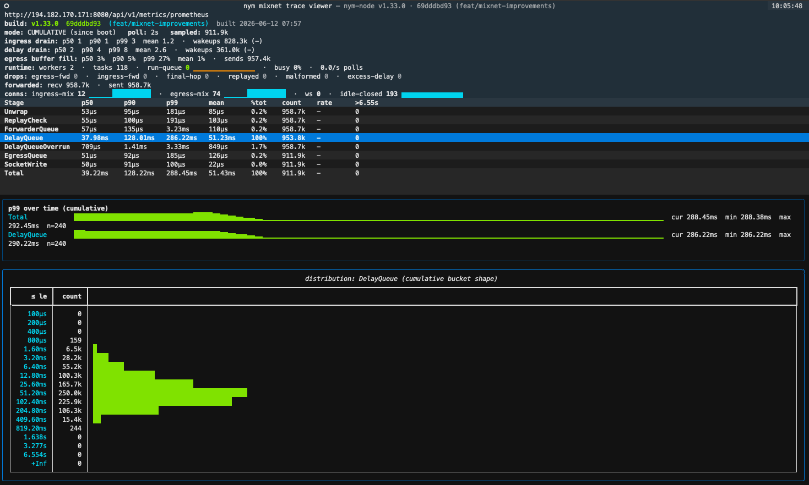

# trace-viewer

> ⚠️ **This tool was fully vibe coded.** Its only purpose is to make it easy to eyeball statistics about a mixnode's packet-processing pipeline. Absolutely no thought has been given to performance or maintainability - treat it as a disposable diagnostic toy, not production-grade software.

Live terminal dashboard for a [nym-node](https://github.com/nymtech/nym)'s mixnet packet-latency stages (the `mixnet_packet_*` prometheus histograms added in #6852).



It scrapes the node's prometheus endpoint, diffs successive scrapes to show the latency distribution and packet rate for the **recent window** (not the lifetime-since-boot average), and renders a per-stage waterfall: `Unwrap -> ReplayCheck -> ForwarderQueue -> DelayQueue -> EgressQueue -> SocketWrite -> Total`, plus the `DelayQueueOverrun` diagnostic.

## Setup

```sh
cd /Users/jedrzej/workspace/trace-viewer
python3 -m venv .venv
.venv/bin/pip install -r requirements.txt
```

## The node side

The endpoint is `GET /api/v1/metrics/prometheus`, protected by a bearer token. The node must have:
- a prometheus bearer token configured (otherwise the route is not exposed), and
- `mixnet.debug.egress_trace_sample_rate` > 0 (default `100` = 1-in-100 packets sampled; `0` disables tracing).

## Run

```sh
# token via env (keeps it out of shell history / chat logs)
export NYM_PROMETHEUS_TOKEN=...
.venv/bin/python -m trace_viewer --url http://127.0.0.1:8080

# or a token file, custom interval
.venv/bin/python -m trace_viewer --url http://NODE:8080 --token-file .token --interval 1

# one-shot snapshot (no TUI), e.g. for piping
.venv/bin/python -m trace_viewer --url http://127.0.0.1:8080 --once
```

### Keys
- `q` quit  ·  `c` toggle window/cumulative  ·  `space` pause  ·  `r` refresh now  ·  `↑/↓` select a stage (updates the distribution panel)

## Notes
- Percentiles are bucket-interpolated (Prometheus `histogram_quantile` style).
- The histograms top out at a `6.5536s` finite bucket; anything slower lands in `+Inf` and is shown in the **`>6.55s`** column. `DelayQueue` legitimately exceeds the lower buckets (it includes the intended mix delay).
- Sampling is **per-connection** on the node side, so the rates here are ~1/N of real traffic, skewed if connections are very unequal.
- The `ingress drain:` / `delay drain:` lines in the status header summarise `mixnet_packet_forwarder_drain_batch_size` and `mixnet_packet_forwarder_delay_drain_batch_size` (packets the forwarder drains per wakeup from the ingress channel and from expired delay-queue items, respectively). p50/p99 well above 1 means the forwarder is batching under load; absent on nodes built before those metrics existed.
- The `egress buffer fill:` line summarises `mixnet_packet_egress_buffer_fill_ratio` (per-connection send-buffer occupancy at send time, sampled). p99 near 100% means a peer's buffer is near full and packets to it are about to drop.
- Runtime scheduling pressure is exported under the `nym_node_tokio_runtime_*` prefix (`global_queue_depth`, `alive_tasks`, and - when the node is built with `RUSTFLAGS="--cfg tokio_unstable"` - `busy_ratio` / `worker_poll_count`). These are not `mixnet_packet_*`, so view them in Prometheus/Grafana rather than this TUI.
- The `drops:` line surfaces the `nym_node_mixnet_*` drop counters (egress/ingress forward, final-hop, replayed, malformed, excessive-delay), red when nonzero, with the increase over the window in parens. Drops never reach the latency histograms (a dropped packet records no stage), so this is the only place they appear - essential for A/B comparisons where a fix trades latency for early drops. The `forwarded:` line shows ingress-received vs egress-sent for throughput/loss context.
- The `conns:` line shows the `nym_node_network_active_*` connection-count gauges (ingress-mix, egress-mix, ws) with a trend sparkline. Steadily-rising counts suggest a connection/task leak; a plateau near the node's peer count is normal persistent connectivity. `ws` should be 0 on a pure mixnode.

## Test
```sh
.venv/bin/python selftest.py
```
